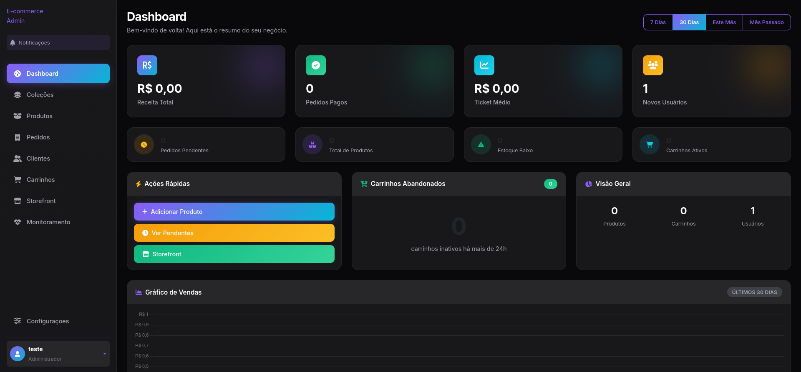
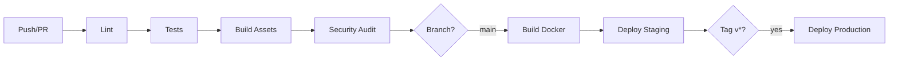

<h1 align="center">🛒 E-commerce Admin Panel White Label</h1>

<p align="center">
  <strong>Uma plataforma de e-commerce enterprise-ready, construída com arquitetura limpa e as melhores práticas da indústria.</strong>
</p>

<p align="center">
  <a href="#-quick-start">Quick Start</a> •
  <a href="#-features">Features</a> •
  <a href="#-arquitetura">Arquitetura</a> •
  <a href="#-documentação">Docs</a> •
  <a href="#-contributing">Contributing</a>
</p>

<p align="center">
  <a href="https://github.com/yourusername/ecommerce-admin/actions/workflows/ci.yml">
    
  </a>
  <a href="https://github.com/yourusername/ecommerce-admin/actions/workflows/deploy.yml">
    
  </a>
  <a href="https://codecov.io/gh/yourusername/ecommerce-admin">
    
  </a>
  <a href="LICENSE">
    
  </a>
  <a href="https://php.net">
    
  </a>
  <a href="https://laravel.com">
    
  </a>
</p>

<br>

> [!NOTE]
> **📋 Sobre este repositório**
> 
> Este repositório foi derivado de um projeto real desenvolvido por mim, com a ideia de ser transformado em um White Label para ecommerces.
> O código foi adaptado e anonimizado para servir como demonstração técnica e portfólio.
> 
> Esse projeto é feito para ser colocado em produção em conjuto com uma storefront separada (utilizando Vue/React/Next.js...) para seu total aproveitamento, sendo caracterizado por ser apenas o painel administrativo.
>
> Este fork personalizado está sendo disponibilizado publicamente como parte do processo seletivo para a vaga de desenvolvedor no **Escavador**.
> 
> O projeto demonstra minhas habilidades em:
> - 🏗️ Arquitetura limpa e SOLID
> - 🧪 Testes automatizados
> - 🐳 DevOps (Docker, CI/CD)
> - 📦 Padrões de projeto (DTOs, Actions, Contracts)

<br>

<p align="center">
  
</p>

---

## ⚡ Quick Start

```bash
# Clone & start em 30 segundos
git clone https://github.com/josuekuhim/ecom-admin-panel.git
cd ecom-admin-panel
make install && make up
```

🎉 **Pronto!** Acesse http://localhost:8000

<details>
<summary>📋 <strong>Pré-requisitos</strong></summary>

| Requisito | Versão |
|-----------|--------|
| Docker | 24+ |
| Docker Compose | 2.20+ |
| Make | qualquer |

> 💡 **Sem Docker?** Veja a [instalação manual](#-instalação-manual)

</details>

---

## ✨ Features

<table>
<tr>
<td width="50%">

### 🎯 Admin Panel
- ✅ Dashboard com métricas real-time
- ✅ Gestão completa de produtos
- ✅ Variantes e imagens ilimitadas
- ✅ Pedidos com tracking de status
- ✅ Gestão de clientes
- ✅ Carrinhos abandonados
- ✅ Tema escuro moderno
- ✅ 100% em Português 🇧🇷

</td>
<td width="50%">

### 🛍️ E-commerce
- ✅ Autenticação via Clerk
- ✅ Login com Google
- ✅ Pagamento PIX (InfinitePay)
- ✅ Cálculo de frete (Correios)
- ✅ API RESTful completa
- ✅ Webhooks seguros
- ✅ Rate limiting
- ✅ CORS configurável

</td>
</tr>
<tr>
<td>

### 🏗️ Arquitetura
- ✅ SOLID Principles
- ✅ Domain Exceptions
- ✅ DTOs tipados
- ✅ Contracts/Interfaces
- ✅ Actions pattern
- ✅ Service layer
- ✅ Repository pattern

</td>
<td>

### 🔧 DevOps
- ✅ Docker multi-stage
- ✅ GitHub Actions CI/CD
- ✅ PHPStan level 5
- ✅ Laravel Pint
- ✅ Testes automatizados
- ✅ Coverage reports
- ✅ Security audits

</td>
</tr>
</table>

---

## 🐳 Desenvolvimento com Docker

### Comandos Essenciais

```bash
make up          # 🚀 Inicia ambiente
make down        # 🛑 Para ambiente
make logs        # 📋 Ver logs
make shell       # 🐚 Acessa container
make test        # 🧪 Roda testes
make lint        # 🔍 Verifica código
```

### Ambiente Completo

```
┌─────────────────────────────────────────────────────────────┐
│                    Docker Environment                       │
├──────────────┬──────────────┬──────────────┬────────────────┤
│     App      │    Nginx     │   Postgres   │     Redis      │
│   PHP 8.2    │   :8000      │    :5432     │     :6379      │
│   + Xdebug   │              │              │                │
├──────────────┼──────────────┴──────────────┴────────────────┤
│    Vite      │              Background Services             │
│   :5173      │         Queue Worker │ Scheduler             │
└──────────────┴──────────────────────────────────────────────┘
```

<details>
<summary>🔧 <strong>Todos os comandos Make</strong></summary>

```bash
# Desenvolvimento
make install      # Instala dependências
make up           # Inicia ambiente
make down         # Para ambiente
make restart      # Reinicia containers
make logs         # Ver logs
make shell        # Shell no app
make shell-db     # Shell no PostgreSQL

# Qualidade
make test         # Roda testes
make test-parallel # Testes paralelos
make coverage     # Testes + coverage
make lint         # Pint + PHPStan
make lint-fix     # Corrige code style

# Database
make migrate      # Roda migrations
make migrate-fresh # Fresh + seed
make seed         # Roda seeders

# Produção
make build        # Build Docker image
make prod-up      # Ambiente produção
make deploy       # Deploy

# Manutenção
make clean        # Remove tudo
make fresh        # Reinstala tudo
make cache        # Otimiza cache
make cache-clear  # Limpa cache
```

</details>

---

## 🏛️ Arquitetura

Este projeto segue **Clean Architecture** e **SOLID Principles**, garantindo código testável, manutenível e escalável.

```
app/
├── Actions/           # 🎯 Use cases (single responsibility)
│   ├── AuthenticateWithClerkAction.php
│   ├── CheckoutOrderAction.php
│   └── CompleteProfileAction.php
│
├── Contracts/         # 📜 Interfaces (dependency inversion)
│   ├── ClerkAuthenticator.php
│   ├── PaymentGateway.php
│   └── ShippingGateway.php
│
├── Data/              # 📦 DTOs (data transfer objects)
│   ├── ClerkUserData.php
│   ├── ProfileData.php
│   └── ClerkTokenClaims.php
│
├── Exceptions/        # ⚠️ Domain exceptions
│   └── Domain/
│       └── AuthenticationException.php
│
├── Services/          # ⚙️ Business logic
│   ├── ClerkAuthenticationService.php
│   ├── ClerkCustomerProvisioningService.php
│   └── InfinitePayService.php
│
└── Http/
    ├── Controllers/   # 🎮 Thin controllers
    ├── Middleware/    # 🛡️ Request filters
    └── Resources/     # 📤 API responses
```

### Design Patterns Utilizados

| Pattern | Uso | Exemplo |
|---------|-----|---------|
| **Dependency Injection** | Inversão de controle | `ClerkAuthMiddleware` recebe interfaces |
| **Factory Method** | Criação de exceptions | `AuthenticationException::invalidToken()` |
| **DTO** | Transferência de dados | `ClerkUserData`, `ProfileData` |
| **Strategy** | Gateways intercambiáveis | `PaymentGateway`, `ShippingGateway` |
| **Action** | Single-use operations | `CheckoutOrderAction` |

---

## 🔄 CI/CD Pipeline



### Workflows

| Workflow | Trigger | Descrição |
|----------|---------|-----------|
| **CI** | Push, PR | Lint, tests, build, security |
| **Deploy** | Push main, tags | Build image, deploy |

<details>
<summary>📋 <strong>Secrets necessários</strong></summary>

```bash
# GitHub Repository Secrets
APP_KEY                    # php artisan key:generate
DB_PASSWORD                # Senha do banco
CLERK_SECRET_KEY           # Clerk.dev
INFINITEPAY_CLIENT_ID      # InfinitePay
INFINITEPAY_CLIENT_SECRET  # InfinitePay
SLACK_WEBHOOK_URL          # (opcional) Notificações
```

</details>

---

## 🛠️ Stack Tecnológica

<table>
<tr>
<td align="center" width="96">
  
  <br>PHP 8.2
</td>
<td align="center" width="96">
  
  <br>Laravel 12
</td>
<td align="center" width="96">
  
  <br>PostgreSQL
</td>
<td align="center" width="96">
  
  <br>Redis
</td>
<td align="center" width="96">
  
  <br>Docker
</td>
<td align="center" width="96">
  
  <br>Nginx
</td>
</tr>
<tr>
<td align="center" width="96">
  
  <br>Next.js 14
</td>
<td align="center" width="96">
  
  <br>TypeScript
</td>
<td align="center" width="96">
  
  <br>Tailwind
</td>
<td align="center" width="96">
  
  <br>Bootstrap 5
</td>
<td align="center" width="96">
  
  <br>Actions
</td>
<td align="center" width="96">
  
  <br>VS Code
</td>
</tr>
</table>

---

## 🔧 Instalação Manual

<details>
<summary>📋 <strong>Sem Docker</strong></summary>

### Pré-requisitos

- PHP 8.2+ com extensões: `pdo_pgsql`, `gd`, `zip`, `intl`, `redis`
- Composer 2.x
- Node.js 20+
- PostgreSQL 16+
- Redis 7+

### Instalação

```bash
# 1. Instalar dependências PHP
composer install

# 2. Configurar ambiente
cp .env.example .env
php artisan key:generate

# 3. Configurar banco de dados no .env
# DB_CONNECTION=pgsql
# DB_HOST=127.0.0.1
# DB_DATABASE=ecommerce
# DB_USERNAME=seu_usuario
# DB_PASSWORD=sua_senha

# 4. Rodar migrations
php artisan migrate --seed

# 5. Instalar dependências Node
npm install

# 6. Build assets
npm run build

# 7. Iniciar servidor
php artisan serve
```

</details>

---

## 🧪 Testes

```bash
# Todos os testes
make test

# Testes paralelos (mais rápido)
make test-parallel

# Com coverage
make coverage

# Arquivo específico
docker compose exec app php artisan test tests/Unit/ClerkAuthMiddlewareTest.php
```

### Estrutura de Testes

```
tests/
├── Unit/                    # Testes unitários
│   ├── ClerkAuthMiddlewareTest.php
│   ├── ClerkServiceTest.php
│   └── CustomerServiceTest.php
└── Feature/                 # Testes de integração
    └── Api/
```

---

## 🤝 Contributing

Contribuições são bem-vindas! Por favor, leia nosso guia:

1. **Fork** o repositório
2. Crie uma **branch**: `git checkout -b feature/amazing-feature`
3. **Commit** suas mudanças: `git commit -m 'Add amazing feature'`
4. **Push** para a branch: `git push origin feature/amazing-feature`
5. Abra um **Pull Request**

### Code Standards

```bash
# Antes de commitar
make lint-fix     # Corrige code style (Pint)
make lint         # Verifica PHPStan
make test         # Roda testes
```

---

## 📄 License

Este projeto está licenciado sob a [MIT License](LICENSE).

---

<p align="center">
  <sub>Construído com ❤️ usando Laravel, Docker e muito ☕</sub>
</p>

<p align="center">
  <a href="#-e-commerce-admin-panel">⬆️ Voltar ao topo</a>
</p>
